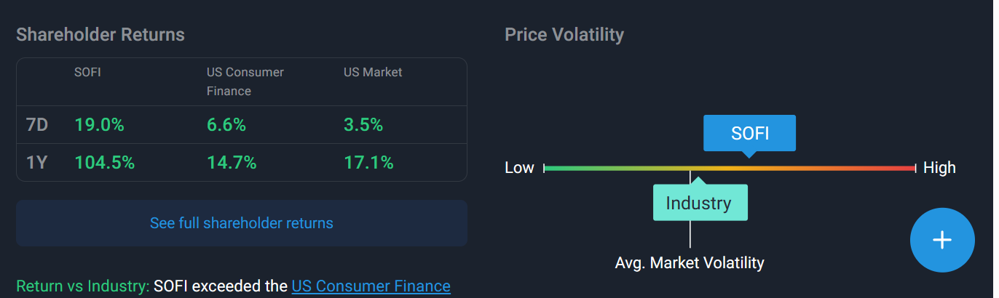

# Sofi, a Fintech in the traditional banking arena, and its disruptive and successful approach to reimagine personal banking by promoting financial empowerment and freedom to its members #

## Overview and Origin ##

Sofi Technologies Inc, better known as SoFi, is an online personal and banking Fintech oriented company incorporated in Delaware and headquartered in San Francisco, CA   by  Mike Cagney, Dan Macklin, James Finnigan, and Ian Brady, who were all Stanford University business school students at the time.
(1)(2)

The idea of Sofi came about as Sofi's founders thought about the traditional student loan arena and set up the goal to provide an alternative financing to student loans in 2011.  Sofi has since grown organically and added several other personal banking products to its portfolio. Anthony Noto, Sofi's current CEO, promotes the values to serve the its members and empowers individuals to rethink their approach to their personal banking needs and  control their finances and financial goals more daring and freely.(3)(4)

Sofi has come a long way since its beginnings as a small private student loan funding alternative.  Funded initially by other Stanford college students and alumni, it has now gone through 18 rounds of fundings raising USD $4.1 Billion dollars including USD $105 Million through one of its funds, Sofi Prime Income Fund, and  its IPO debut in June, 2021 with the stock ticker NASDAQ:SOFI.(5)

- -

## Business Activities ##

Sofi intends to provide a variety of traditional personal banking products and services utilizing a variety of technology platforms online and without any physical branches.  Sofi clients, which the company calls members, have access to a variety of personal banking products that allows them to borrow, save, spend and invest depending on their needs and financial goals.

As of December 2022, the Financial Services market was valued at approximately at USD 26 Billion.This number is about 26% of the nation's GDP and Sofi has shown is true potential as a banking industry disruptor (6)

Sofi, as a true Fintech in the financial services industry, relies heavily on technological platforms to deliver its financial products and solutions to its members.  For example, Galileo is the technology platform used for its brokerage services and Technisys, is their cloud based core banking platform. Sofi Invest, allows its members to actively trade and/or receive investment investment advice through digital assets accounts. (7)

Sofi's success comes from its reliance on easily accessible mobile banking platforms that do not rely on physical branches and avoids the overhead costs that other financial services with similar products may have in their balance sheet. (8)

As shown in the SymplyWallstreet graph below, Sofi shows promising expected returns as a disruptive fintech in the financial services:

image[

- -

## Landscape ##

Sofi is a disruptor of the traditional branch based personal banking. It is a one stop shop for personal financial products where its members can borrow, save or spend their money. Its focus is on helping its members achieve their personal objectives and transform the traditional banking relationship management by offering lending, technology platforms and Financial services as its main segments.(9)

Personal banking has experienced several changes in the past years.  The reduction of physical footprints in the way of physical branches has been a banking trend in the past decade. The use of mobile technologies and technology based platforms have been clear disruptors in transaction banking processes.  

The growth of companies such as Ally Financial NYSE:ALLY, FirstCash Holdings NASDAQGS:FCFS and Credit Acceptance NASDAQGS: CACC are clear indicators that the presentation and delivery of personal financial products and services are experiencing a deep transformation with the application of new technologies that facilitate and improve the client experience and deliver an alternative to individuals looking for efficiencies as a result of the Fintech disruptions.(10)

- -

## Results ##

Sofi has the ability to offer  High Yield savings accounts and low cost loans than its competitors.  Moreover, Sofi only received its National banking charter in 2022 and has experienced a tremendous growth with  USD 15.7 billion in deposits since then.(8) (11)

Some analysts believe that SoFi stock is set for significant growth and will benefit from the trend of technological expansion and interest in Fintech. Visa and Paypal also appear in the list.  However, Sofi also focuses on student loans that were mostly held by the U.S government.  With the U.S having 44 million students in the market for student loans, it is expected that Sofi experiences growth as individuals look for alternatives from the traditional banking services industry.

- -  

## Recommendations ## 

Most of these investment platforms utilize similar technologies, one of the most popular is  Cachematrix, a subsidiary of Blackrock, that services white label platforms for a variety of banks.  I believe Sofi may utilize its already in house SofiInvest platform as a start. Lastly, I would recommend that Sofi develops the book of record platforms as proprietary, since most of the traditional banking industry uses old software such as SEI for their bookkeeping which presents a challenge for the more user friendly and modern applications we see in online banking today.

## Documentation

(1) https://www.sec.gov/cgi-bin/browse-edgar?company=sofi+technologies&match=starts-with&filenum=&State=&Country=&SIC=&myowner=exclude&action=getcompany 

(2)https://en.wikipedia.org/wiki/SoFi#:~:text=In%202023%2C%20SoFi%20was%20named,%2410bn%20in%20total%20deposits. 

(3) https://www.sofi.com/how-it-works/

(4) https://open.spotify.com/show/6lRDb03qGUbWaJc3jLkrUi?si=dhu7H3VJTiK5dn6X_dz7qA

(5) https://www.crunchbase.com/organization/social-finance/company_financials

(6) https://finance.yahoo.com/news/financial-services-industry-outlook-estimated-153000319.html

(7) https://simplywall.st/stocks/us/diversified-financials/nasdaq-sofi/sofi-technologies/information

(8) https://www.fool.com/investing/2023/12/13/where-is-sofi-heading-in-2024-3-bold-predictions-f/?source=eptyholnk0000202&utm_source=yahoo-host-full&utm_medium=feed&utm_campaign=article

(9)https://d18rn0p25nwr6d.cloudfront.net/CIK-0001818874/04cfaadb-4aed-466a-8dce-01f595d6df76.pdf

(10) https://simplywall.st/stocks/us/diversified-financials/nasdaq-sofi/sofi-technologies

(11) https://www.sofi.com/our-story/

## Acknowledgements

 - Awesome Readme Templates](https://awesomeopensource.com/project/elangosundar/awesome-README-templates)

